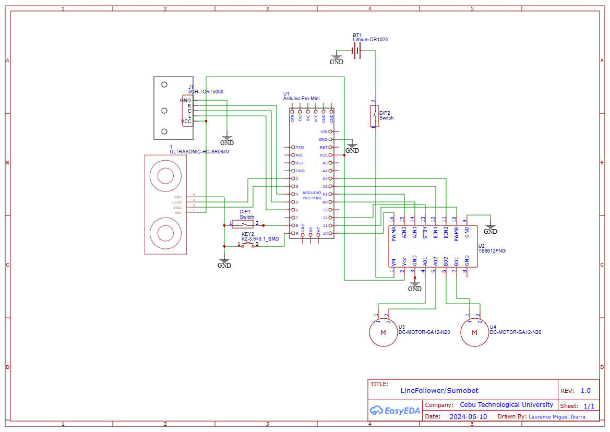
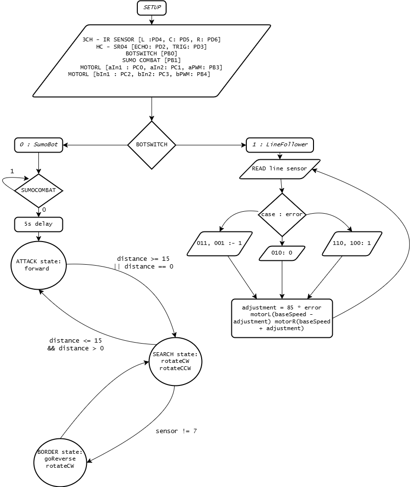

# Multifunctional Robot Project

## Key Features
- **Selector Switch:** Enables easy switching between Line Follower and Sumobot modes.
- **Combat Mode Activation:** A push button initiates Combat Mode with a 5-second delay.

## Schematic Diagram
 <!-- Update with the actual image path -->

## Flowchart
 <!-- Update with the actual image path -->

## Line Follower Mode

### Input Section
| Sensor  | Fluorescent Light | No Light | Ambient Light |
|---------|-------------------|----------|---------------|
|         | Black (V) | White (V) | Black (V) |
| Left    | 4.0 - 5.0 | 0.1 - 1.0 | 4.0 - 5.0 |
| Center  | 4.0 - 5.0 | 0.1 - 1.0 | 4.0 - 5.0 |
| Right   | 4.0 - 5.0 | 0.1 - 1.0 | 4.0 - 5.0 |

### Proportional Control in Line Following
- **Proportional Control:** Adjusts the system based on the error magnitude, where the correction is proportional to the difference between the desired and actual positions.
  
- **Application in Line Following:**
  - **Error Calculation:** The error represents the deviation of the robot from the center of the line. Sensor readings (e.g., 010, 011, 100) indicate the line's position relative to the robot.
  - **Correction Using Proportional Term:** An adjustment value is computed as:
    \[
    \text{adjustment} = K_p \times \text{error}
    \]
    Where \( K_p \) is a constant that determines the response sensitivity.
  - **Motor Speed Adjustment:**
    - \( \text{leftSpeed} = \text{baseSpeed} - \text{adjustment} \)
    - \( \text{rightSpeed} = \text{baseSpeed} + \text{adjustment} \)

This ensures the robot steers back towards the line, correcting its path smoothly and responsively.

## Sumobot Mode

### State Machines
State machines manage the robot's behavior based on defined states, allowing for organized and predictable actions.

- **Application in Sumobot:**
  - **States Defined:**
    - **SEARCH:** The robot searches for an opponent.
    - **ATTACK:** The robot advances when the opponent is detected.
    - **BORDER:** The robot retreats and rotates when it detects the border of the arena.

### State Transitions
- **SEARCH to ATTACK:** Transition occurs when the opponent is detected within a certain range by the ultrasonic sensor.
- **SEARCH to BORDER:** Transition happens if the line sensors detect the border.
- **BORDER to SEARCH:** After handling the border detection, the robot returns to the SEARCH state.

### Time Referencing for Non-Blocking Delays
Non-blocking delays (using `millis()`) are used instead of traditional delay functions to keep the robot responsive.

- **Search Rotation:** The robot alternates rotation direction periodically while searching. Time referencing allows the robot to rotate for a specific period and then switch directions. Despite not finishing the rotation, the robot can transition to the ATTACK state if an opponent is detected. This responsiveness is due to using time referencing instead of blocking delays, allowing the robot to react immediately to new conditions.
